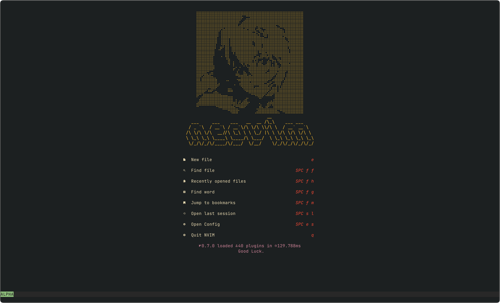

    <h1>Neovim Config</h1>
    
    

What's this about?
---
Neovim is a lightweight yet powerful text editor/IDE/[PDE](https://youtu.be/QMVIJhC9Veg) focused on extensibility and user ergonomics.
This config written in Lua is tailor-made by me for me for maximum comfort and productivity.
Enjoy if you want.

Screenshots
---

Gruvbox theme

Plugins
---
- Comment.nvim
- alpha-nvim
- bufferline.nvim
- coq.artifacts
- coq.thirdparty
- coq_nvim
- dressing.nvim
- feline.nvim
- gitsigns.nvim
- gruvbox-material
- impatient.nvim
- indent-blankline.nvim
- lightspeed.nvim
- lspsaga.nvim
- nrpattern.nvim
- nvim-colorizer.lua
- nvim-gps
- nvim-hlslens
- nvim-lsp-installer
- nvim-lspconfig
- nvim-notify
- nvim-scrollbar
- nvim-tree.lua
- nvim-treesitter
- nvim-web-devicons
- packer.nvim
- plenary.nvim
- telescope-file-browser.nvim
- telescope-fzf-native.nvim
- telescope.nvim
- themer.lua
- trouble.nvim
- vim-dadbod
- vim-dadbod-completion
- vim-dadbod-ui
- vim-fugitive
- vim-repeat
- vim-surround
- vim-unimpaired
- which-key.nvim
